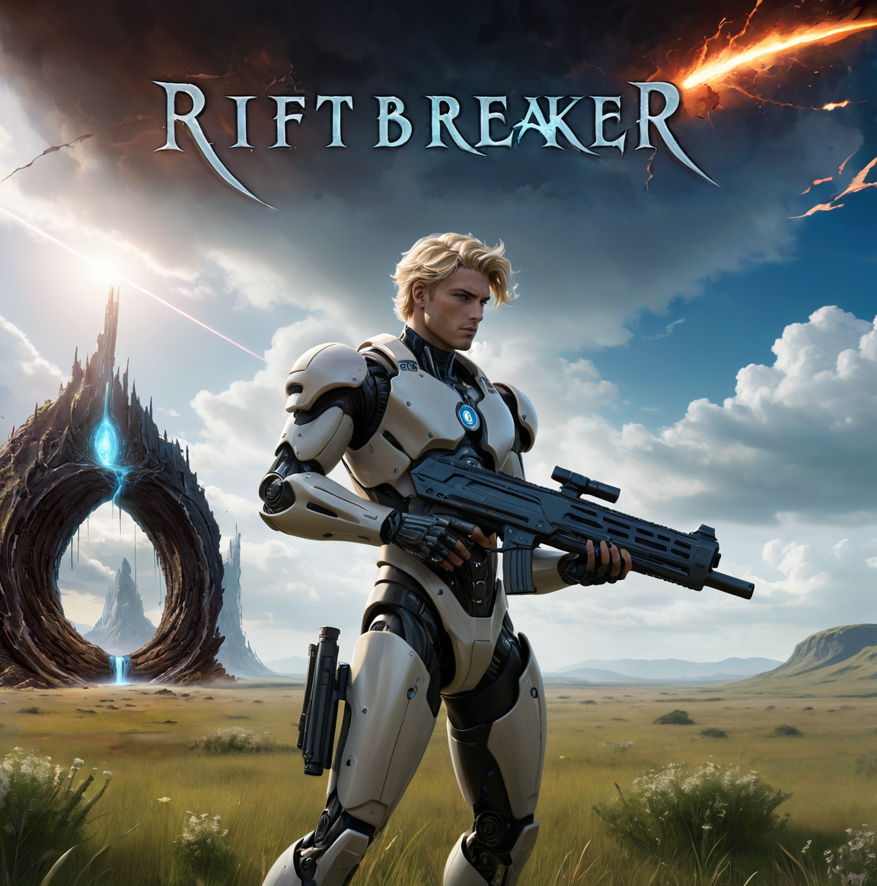

# Rift Breaker

Rift Breaker is an open source game created in [Rust](https://www.rust-lang.org/) using [Bevy](https://bevyengine.org/). It draws inspiration from excellent rogue-like bullet hell games such as [Vampire Survivors](https://store.steampowered.com/app/1794680/Vampire_Survivors/) and [Enter the Gungeon](https://store.steampowered.com/app/311690/Enter_the_Gungeon/).

It is intented as learning resources for myself and potentially other like-minded individuals attempting to learn Rust and Bevy.

Your goal as player: defend against waves of monsters emerging from interdimensional rifts.


<div style="text-align:center">

</div>


## Play
Play the game with 
```shell
cargo run
```

## Controls
- `WASD` to move the player
- Mouse to aim 
- Left mouse button to fire

## Art
The art is generated with Stable Diffusion 1.5 XL. The logo itself was generated with checkpoints [Gleipnir](https://civitai.com/models/175094?modelVersionId=226341) and [Starlight XL](https://civitai.com/models/143043?modelVersionId=182077) in [Fooocus](https://github.com/lllyasviel/Fooocus) and the text with the [Texta](https://civitai.com/models/221240?modelVersionId=249521) LORA
